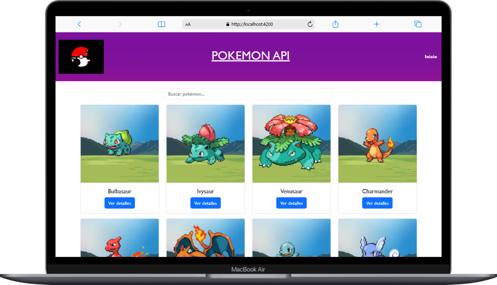
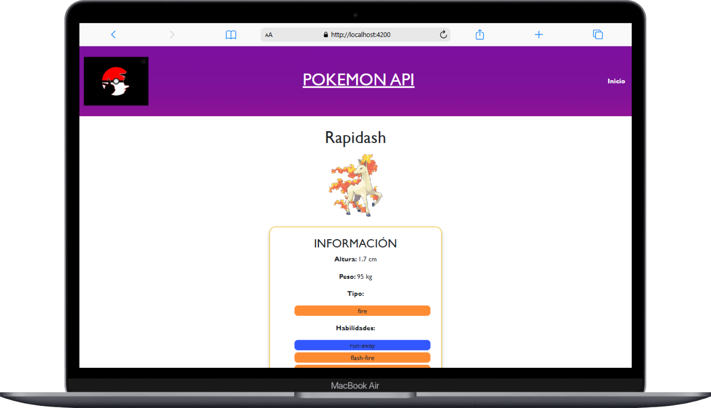

# Pokémon API con Angular  🎮🔥


## 📌 Descripción

Esta es una aplicación creada con **Angular** que consume la **Pokémon API**. Te permite explorar una lista de Pokémon, ver los detalles más destacados de cada uno de los pokemons y disfrutar de una interfaz dinámica y atractiva. Ideal para practicar **peticiones HTTP, componentes dinámicos y animaciones** en Angular. 🚀

## 🎥 Demo


## ✨ Características

- 📜 Lista de Pokémon con imágenes y nombres.
- 🔍 Búsqueda de Pokémon por nombre.
- 📊 Visualización de peso, altura, tipo y habilidades.
- 🌙 **Modo oscuro / claro**.

## 🛠 Tecnologías utilizadas

- [Angular](https://angular.io/)
- [PokéAPI](https://pokeapi.co/)
- TypeScript
- HTML & SCSS

## 🚀 Instalación y ejecución

1. Clona este repositorio:
   ```sh
   git clone https://github.com/itsazahara/pokemon-api.git
   ```
2. Entra en la carpeta del proyecto:
   ```sh
   cd pokemon-api
   ```
3. Instala las dependencias:
   ```sh
   npm install
   ```
4. Ejecuta el servidor de desarrollo:
   ```sh
   ng serve
   ```
5. Abre en tu navegador:
   ```
   http://localhost:4200/
   ```

## 📸 Capturas de pantalla

| 📱 Vista principal | 🔍 Búsqueda |
|--------------------|------------|
|  |  |

## 🤝 Contribuciones

¡Las contribuciones son bienvenidas! Si quieres mejorar la aplicación, sigue estos pasos:
1. **Fork** el repositorio 🍴
2. Crea una nueva rama: `git checkout -b mi-nueva-feature` 🔄
3. Realiza tus cambios y haz commit: `git commit -m "Añadí una nueva feature"` 📝
4. Haz push a la rama: `git push origin mi-nueva-feature` 🚀
5. Abre un **Pull Request** 📩

---
_Hecho con ❤️ por [Azahara](https://github.com/itsazahara)_
